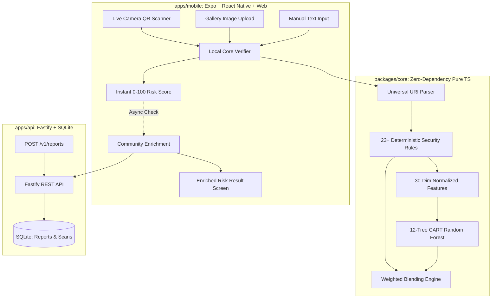

# UPI QR Verifier
> **Cover Title: Payment QR Code Alert System**

[](https://github.com/ChandrashekharaKM/UPI_QR_Verifier/actions/workflows/ci.yml)
[](https://www.typescriptlang.org/)
[](https://opensource.org/licenses/MIT)

A complete, cross-platform TypeScript application that scans or uploads UPI payment QR codes **BEFORE** the user pays, decodes and validates parameters against NPCI specifications, performs heuristic security analysis, executes on-device machine learning inference, and displays a calibrated 0–100 risk score (Safe / Suspicious / High Risk) with plain-language explanations.

> [!WARNING]
> **Risk-Warning Disclaimer**: This tool is an automated risk-warning advisory instrument based on protocol rules, heuristic patterns, and machine learning indicators. It is **never a guarantee of safety**. Users must always verify recipient identity independently before authorizing payments.

---

## Architecture Overview



---

## Monorepo Structure

```
UPI QR Verifier/
├── packages/
│   └── core/                 # Pure TypeScript, zero external dependencies
│                             # UPI parser, validators, rule engine, features, ML tree traversal, scoring
├── ml/                       # TypeScript ML training & evaluation pipeline (tsx)
│                             # Synthetic data generator, CART / Random Forest, metrics & ablation
├── apps/
│   ├── api/                  # Fastify + Zod + SQLite reputation backend service
│   └── mobile/               # Expo + React Native + react-native-web cross-platform application
├── docs/
│   ├── sample-fixtures/      # Programmatically generated test QR images
│   └── project-report-mapping.md # Academic & technical synopsis mapping document
└── docker-compose.yml        # Containerized SQLite backend deployment
```

---

## Security Rules Matrix

The deterministic engine evaluates 23 specialized security rules categorized by threat domain:

| Rule ID | Severity | Weight | Condition & Purpose | Plain-Language Advisory |
|---|---|---|---|---|
| `RULE_NON_UPI_SCHEME` | `critical` | 85 | Scanned code is a web URL or non-UPI URI | "Does not contain a direct UPI link. Opening external web links can lead to phishing or malware." |
| `RULE_HTTP_NOT_HTTPS` | `high` | 70 | Destination link uses unencrypted HTTP | "Uses unencrypted HTTP protocol. Legitimate banking portals require HTTPS." |
| `RULE_IP_ADDRESS_URL` | `high` | 80 | URL points to raw IP address | "Points directly to an IP address rather than an authenticated bank domain." |
| `RULE_SHORTENED_URL` | `medium` | 65 | URL uses link shortening service (`bit.ly`, etc.) | "Destination address is masked by a link shortener, concealing the actual payment recipient." |
| `RULE_SUSPICIOUS_TLD` | `medium` | 60 | Domain ends in spam-heavy TLD (`.xyz`, `.top`, etc.) | "Domain uses an extension heavily associated with disposable phishing campaigns." |
| `RULE_PUNYCODE_DOMAIN` | `high` | 80 | Domain contains punycode characters (`xn--`) | "Contains punycode characters, a common technique for visual homograph impersonation." |
| `RULE_UNKNOWN_PSP` | `medium` | 45 | Handle suffix is not in official NPCI allowlist | "UPI handle is not on the recognized NPCI banking PSP allowlist." |
| `RULE_VPA_HIGH_ENTROPY` | `medium` | 35 | Username has high Shannon entropy ($H \ge 3.4$) | "Contains randomized character sequences typical of disposable burner accounts." |
| `RULE_VPA_EXCESSIVE_DIGITS` | `low` | 25 | High ratio of numeric digits in non-phone VPA | "Contains an unusually high concentration of numeric digits." |
| `RULE_VPA_IMPERSONATION` | `critical` | 85 | VPA local part contains bank/helpline keywords | "Impersonates official customer care, banking support, or government bodies." |
| `RULE_MISSING_PAYEE_NAME` | `low` | 25 | Parameter `pn` is omitted | "QR does not declare a registered payee name (`pn`)." |
| `RULE_NAME_VPA_MISMATCH` | `medium` | 35 | Jaro-Winkler similarity between Name and VPA is low | "Declared payee name has virtually no correlation with the UPI handle." |
| `RULE_URGENCY_KEYWORDS` | `high` | 60 | Name or remarks contain "refund", "prize", "KYC" | "High-risk psychological urgency or prize bait keywords detected." |
| `RULE_HIGH_AMOUNT` | `high` | 50 | Pre-filled amount $\ge ₹25,000$ or exceeds limit | "Pre-filled with an unusually high amount. Verify before entering PIN." |
| `RULE_ROUND_BAIT_AMOUNT` | `medium` | 35 | Pre-filled amount matches lure pricing (9999, etc.) | "Amount matches common psychological lure pricing frequently seen in promotional scams." |
| `RULE_REFUND_VERIFY_NOTE` | `critical` | 85 | Remarks ask for "refund" or "verification" | "**CRITICAL:** You NEVER scan a QR code or enter a PIN to receive money. Scanning this will deduct funds." |
| `RULE_MISSING_MC_BUSINESS` | `medium` | 40 | Name claims commercial entity but lacks 4-digit MCC | "Payee name claims commercial business but lacks an official 4-digit MCC." |
| `RULE_DUPLICATE_PARAMETERS` | `high` | 65 | Query string contains repeated parameter keys | "Parameter pollution detected. Repeated keys can trick payment apps into charging an attacker." |
| `RULE_UNKNOWN_PARAMETERS` | `low` | 20 | Non-standard query parameters present | "Carries unexpected extra query parameters deviating from standard NPCI format." |
| `RULE_OVERSIZED_PAYLOAD` | `low` | 20 | Payload length exceeds 512 characters | "QR payload significantly exceeds typical compact UPI QR code dimensions." |
| `RULE_INVALID_CURRENCY` | `high` | 75 | Currency parameter is not INR | "Transaction specifies non-INR currency. Standard domestic UPI strictly requires INR." |
| `RULE_COMMUNITY_HIGH_REPORTS` | `high` | 60–85 | 2+ crowd-sourced scam reports on record | "This recipient has multiple scam reports registered by community users." |
| `RULE_COMMUNITY_RECENT_REPORTS`| `medium` | 40 | Reports logged within the last 7 days | "Scam reports logged very recently, indicating active malicious campaigns." |

---

## Scoring Formula & Calibration

The final risk score ($0$ to $100$) is calculated using a calibrated weighted blend:

$$\text{FinalScore} = \text{Clamp}_{[0, 100]}\Big(\text{RuleScore} \times 0.65 + \text{MLScore} \times 0.35 + \text{CommunityPenalty}\Big)$$

Where:
- **$\text{RuleScore}$**: Deterministic score derived from the maximum triggered rule weight plus diminishing returns on remaining headroom:
  $$\text{AccumulatedScore} = W_0 + \sum_{j=1}^{k} \frac{W_j}{100} \times (100 - \text{AccumulatedScore}) \times 0.45$$
- **$\text{MLScore}$**: Random Forest predicted scam probability scaled to $[0, 100]$.
- **$\text{CommunityPenalty}$**: $\min(25, \text{ReportCount} \times 8)$.

### Thresholds & Categorization

| Score Range | Category | Color | Mandatory UI Policy |
|---|---|---|---|
| **0 – 30** | `SAFE` | `#10B981` (Emerald) | **Never bare "Safe"**: Must state *"No major risk indicators found; verify the receiver before paying."* If unverified, adds an explicit "Unverified" note. |
| **31 – 70** | `SUSPICIOUS` | `#F59E0B` (Amber) | Displays highlighted warning cards explaining intermediate risk factors. |
| **71 – 100** | `HIGH_RISK` | `#EF4444` (Crimson) | Prominent warning reticle. "Continue anyway" requires an explicit two-step confirmation dialog. |

---

## Setup & Quickstart

### Prerequisites
- **Node.js**: v20 or v22 LTS
- **pnpm**: v10+ or v12+ (`npm install -g pnpm`)

### 1. Installation
```bash
# Clone the repository
git clone https://github.com/ChandrashekharaKM/UPI_QR_Verifier.git
cd UPI_QR_Verifier

# Install all monorepo dependencies
pnpm install

# Approve build scripts for better-sqlite3 and esbuild
pnpm approve-builds --all
```

### 2. Run Tests & Typecheck
```bash
# Run 87 unit and integration tests across core and api
pnpm test

# Run strict TypeScript typecheck across all 4 workspaces
pnpm typecheck

# Build core library
pnpm build:core
```

### 3. Start Backend Service
```bash
# Start API in development mode (port 3001)
pnpm --filter @upi-verifier/api dev

# Interactive Swagger documentation:
# Open http://localhost:3001/documentation in your browser
```

### 4. Start Mobile & Web App
```bash
# Start Expo development server (opens interactive terminal)
pnpm --filter @upi-verifier/mobile start

# Open Web version directly:
pnpm --filter @upi-verifier/mobile web

# Export static production web bundle:
pnpm --filter @upi-verifier/mobile build:web
```

---

## API Reference (`apps/api`)

### `GET /v1/health`
Health and diagnostic check.
```json
{
  "status": "ok",
  "version": "1.0.0",
  "timestamp": "2026-10-08T14:00:00.000Z",
  "uptime": 128.4
}
```

### `POST /v1/verify`
Full server-side verification enriched with community reputation.
- **Body**: `{ "payload": "upi://pay?pa=store@oksbi&pn=Store&am=200", "optInTelemetry": false }`
- **Response**: Full `VerificationResult` + `communityReputation` metrics. Privacy-safe: never stores raw payload unless `optInTelemetry` is true.

### `POST /v1/reports`
Submits an anonymized crowd-sourced scam report.
- **Body**: `{ "vpa": "scam@ybl", "reason": "fake_support", "note": "Impersonated bank care" }`
- **Response**: `201 Created` or `409 Conflict` (deduplicated per device hash).

### `GET /v1/vpa/:vpa/reputation`
Retrieves verified report statistics.
- **Response**: `{ "vpa": "scam@ybl", "reportCount": 3, "lastReportedDaysAgo": 1, "topCategories": ["fake_support"] }`

---

## Machine Learning Pipeline & Retraining (`ml/`)

To generate new synthetic datasets, evaluate model performance, and re-export trees to the core engine:

```bash
# Run training, evaluation, ablation, and export pipeline:
pnpm --filter @upi-verifier/ml train
```

This updates:
1. `ml/reports/metrics.json` – Real evaluation metrics on held-out test splits.
2. `ml/reports/REPORT.md` – Evaluation report with synthetic data caveat notice.
3. `packages/core/src/model/model.json` – Compact tree structure consumed on-device.

---

## System Limitations

1. **Physical Sticker Tampering**: Criminals can physically paste fraudulent printed QR codes over legitimate merchant stands. The QR data itself may be syntactically valid while routing money to an unauthorized individual. Users must physically inspect counter QR stands for peeling or overlaid stickers.
2. **Zero-Day Scam Accounts**: A newly created bank account will have valid bank syntax and zero prior community reports. The app assigns an "Unverified" caveat to newly seen handles, mandating manual verification.
3. **No Safety Guarantee**: Risk scores are heuristic estimations. Antivirus and risk-scoring instruments can never offer a 100% safety guarantee.

---

## Android APK Build (EAS)

To build a standalone Android APK using Expo Application Services (EAS):

```bash
# Install EAS CLI
npm install -g eas-cli

# Login to Expo
eas login

# Configure build profile
eas build:configure

# Build standalone Android APK
eas build -p android --profile preview
```

---

## Detailed Project Report Mapping

For complete algorithm pseudocode, methodology phase-by-phase mappings, and the synopsis tools matrix, see [`docs/project-report-mapping.md`](docs/project-report-mapping.md).

---

## License
MIT © ChandrashekharaKM
