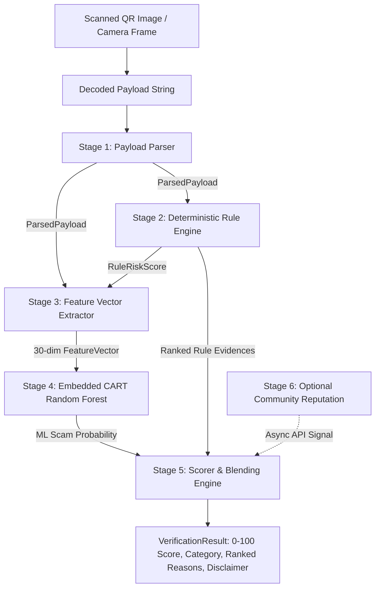

# Project Report Mapping: UPI QR Verifier
> **Cover Title: Payment QR Code Alert System**
> Academic & Technical Project Synopsis to Codebase Mapping Document

This document details how each section of the project synopsis, methodology, algorithmic formulations, risk score categorization tables, and tooling specifications maps directly to concrete TypeScript implementations in this repository.

---

## 1. Methodology Mapping to Source Code



| Methodology Stage | Synopsis Description | Concrete Implementation Files | Key Functions & Classes |
|---|---|---|---|
| **Stage 1: Payload Ingestion & Parsing** | Validates `upi://pay` URI parameters, case normalization, URL decoding, duplicate parameter pollution detection, and non-UPI scheme routing. | [`packages/core/src/parser/upi-parser.ts`](../packages/core/src/parser/upi-parser.ts)<br>[`packages/core/src/parser/url-parser.ts`](../packages/core/src/parser/url-parser.ts)<br>[`packages/core/src/parser/payload-parser.ts`](../packages/core/src/parser/payload-parser.ts) | `parsePayload()`<br>`parseUpiPayload()`<br>`parseUrlPayload()` |
| **Stage 2: Deterministic Rule Engine** | Pure functional rule checkers evaluating protocol anomalies, PSP allowlists, Shannon entropy, brand impersonation, and refund traps. | [`packages/core/src/rules/rules-protocol.ts`](../packages/core/src/rules/rules-protocol.ts)<br>[`packages/core/src/rules/rules-vpa.ts`](../packages/core/src/rules/rules-vpa.ts)<br>[`packages/core/src/rules/rules-payee.ts`](../packages/core/src/rules/rules-payee.ts)<br>[`packages/core/src/rules/rules-transaction.ts`](../packages/core/src/rules/rules-transaction.ts)<br>[`packages/core/src/rules/rules-payload.ts`](../packages/core/src/rules/rules-payload.ts)<br>[`packages/core/src/rules/engine.ts`](../packages/core/src/rules/engine.ts) | `evaluateRules()`<br>`ALL_RULES`<br>`ruleVpaImpersonation()`<br>`ruleRefundVerifyNote()` |
| **Stage 3: Feature Extraction** | Extracts a versioned 30-dimensional normalized continuous vector in range $[0.0, 1.0]$. | [`packages/core/src/features/feature-schema.ts`](../packages/core/src/features/feature-schema.ts)<br>[`packages/core/src/features/feature-extractor.ts`](../packages/core/src/features/feature-extractor.ts) | `FEATURE_NAMES`<br>`extractFeatureVector()` |
| **Stage 4: On-Device ML Inference** | Zero-dependency recursive tree traversal evaluating a 12-tree Random Forest ensemble without external C++ or native runtime dependencies. | [`packages/core/src/ml/inference.ts`](../packages/core/src/ml/inference.ts)<br>[`packages/core/src/model/model.json`](../packages/core/src/model/model.json) | `predictTree()`<br>`predictRandomForest()` |
| **Stage 5: Blending & Scoring** | Blends rule score ($65\%$) and ML probability ($35\%$), applies community penalty, clamps to $[0, 100]$, and assigns category & confidence notes. | [`packages/core/src/scoring/config.ts`](../packages/core/src/scoring/config.ts)<br>[`packages/core/src/scoring/scorer.ts`](../packages/core/src/scoring/scorer.ts)<br>[`packages/core/src/verifier.ts`](../packages/core/src/verifier.ts) | `calculateVerificationScore()`<br>`verifyQrPayload()` |
| **Stage 6: Decentralized Community Reputation** | Fastify backend providing crowd-sourced report storage, rate limiting, and SHA-256 device anonymization. | [`apps/api/src/routes/verify.ts`](../apps/api/src/routes/verify.ts)<br>[`apps/api/src/routes/reports.ts`](../apps/api/src/routes/reports.ts)<br>[`apps/api/src/routes/reputation.ts`](../apps/api/src/routes/reputation.ts)<br>[`apps/api/src/db/client.ts`](../apps/api/src/db/client.ts) | `DatabaseClient`<br>`getVpaReputation()`<br>`insertReport()` |

---

## 2. Algorithm 1: Universal UPI URI Parsing & Parameter Sanitization

### Pseudocode (Synopsis Formulation)
```
Input: Raw scanned string S
Output: Typed ParsedPayload { kind, fields, parseWarnings, hasDuplicateParams }

1. Trim leading and trailing whitespace from S.
2. If Length(S) > 512 characters, append Warning("Oversized payload").
3. If Lowercase(S) starts with "upi://pay":
     a. Extract query substring after '?'.
     b. Split query by '&' delimiter into key-value pairs.
     c. For each pair:
          i. Decode URI percent-encoding safely.
          ii. If key is already seen in parameter map:
                Mark hasDuplicateParams = true, record duplicate key warning.
              Else:
                Store key-value in parameter map.
     d. If mandatory parameter 'pa' is missing or empty, return Failure.
     e. Extract standard fields (pn, am, cu, mc, tr, tn, url).
     f. Collect all non-standard query keys into extraParams.
     g. Return { kind: 'upi', fields: UpiFields, parseWarnings }.
4. Else if Lowercase(S) starts with "http://" or "https://":
     a. Parse URL components (protocol, hostname, pathname, searchParams).
     b. Check for raw IP address regex or bracketed IPv6.
     c. Check hostname against known shortening domains.
     d. Check for punycode encoding ("xn--") and suspicious TLDs.
     e. Return { kind: 'url', fields: UrlFields, parseWarnings }.
5. Else:
     a. Check for non-payment schemes (wifi:, mailto:, tel:, intent:).
     b. Return { kind: 'other', fields: OtherFields, parseWarnings }.
```

### Code Mapping
- Implemented in: [`packages/core/src/parser/upi-parser.ts`](../packages/core/src/parser/upi-parser.ts#L33-L140) and [`packages/core/src/parser/payload-parser.ts`](../packages/core/src/parser/payload-parser.ts#L13-L84).
- Unit Tests: [`packages/core/test/parser.test.ts`](../packages/core/test/parser.test.ts) (Tests 1 through 13).

---

## 3. Algorithm 2: Deterministic Rule Risk Evaluation with Diminishing Headroom

### Pseudocode (Synopsis Formulation)
```
Input: RuleContext { parsed, community }
Output: { allResults, triggeredRules, ruleRiskScore }

1. Initialize triggeredRules = []
2. For each registered rule function Rule_i in ALL_RULES:
     a. Result = Rule_i(RuleContext)
     b. If Result.triggered is True, append Result to triggeredRules.
3. If triggeredRules is empty, return ruleRiskScore = 0.
4. Sort triggeredRules descending by weight W:
     W_sorted = [W_0, W_1, ..., W_k] where W_0 >= W_1 >= ... >= W_k.
5. Initialize AccumulatedScore = W_0.
6. For each subsequent weight W_j from index 1 to k:
     a. Headroom = 100 - AccumulatedScore.
     b. DiminishingFactor = 0.45.
     c. AccumulatedScore = AccumulatedScore + (W_j / 100) * (Headroom * DiminishingFactor).
7. Return ruleRiskScore = Min(100, Round(AccumulatedScore)).
```

### Code Mapping
- Implemented in: [`packages/core/src/rules/engine.ts`](../packages/core/src/rules/engine.ts#L67-L121).
- Unit Tests: [`packages/core/test/rules.test.ts`](../packages/core/test/rules.test.ts) (Tests 31 through 53).

---

## 4. Algorithm 3: On-Device Random Forest Tree Traversal & Score Blending

### Pseudocode (Synopsis Formulation)
```
Input: FeatureVector X, TrainedModel M, RuleRiskScore R, CommunitySignal C
Output: VerificationResult { score, category, reasons, confidenceNote, disclaimer }

1. Traverse each decision tree T_i in M.trees:
     Node = T_i.root
     While Node.isLeaf is False:
       If X[Node.featureIndex] <= Node.threshold:
         Node = Node.leftChild
       Else:
         Node = Node.rightChild
     TreeProbability_i = Node.probability
2. Compute ensemble scam probability:
     P_ml = (1 / nEstimators) * Sum(TreeProbability_i for all i)
3. Compute ML scaled score:
     S_ml = Round(P_ml * 100)
4. Compute Community Penalty:
     P_comm = Min(25, C.reportCount * 8) if C is present else 0
5. Compute Final Blended Score:
     RawScore = (R * 0.65) + (S_ml * 0.35) + P_comm
     FinalScore = Min(100, Max(0, Round(RawScore)))
6. Assign Risk Category:
     If FinalScore <= 30: Category = "SAFE"
     Else if FinalScore <= 70: Category = "SUSPICIOUS"
     Else: Category = "HIGH_RISK"
7. Format ranked reasons by descending impact points.
8. Annotate confidence note (Mandatory caveat for SAFE: "No major risk indicators found; verify the receiver before paying").
```

### Code Mapping
- Implemented in: [`packages/core/src/ml/inference.ts`](../packages/core/src/ml/inference.ts#L7-L40) and [`packages/core/src/scoring/scorer.ts`](../packages/core/src/scoring/scorer.ts#L25-L122).
- Unit Tests: [`packages/core/test/scoring.test.ts`](../packages/core/test/scoring.test.ts) (Tests 54 through 59) and [`packages/core/test/ml-inference.test.ts`](../packages/core/test/ml-inference.test.ts) (Tests 60 through 63).

---

## 5. Risk Score Categorization Table Mapping

| Score Range | Category Code | Color Palette | Mandatory Advisory / Confidence Note | UI Behavior & Action |
|---|---|---|---|---|
| **0 – 30** | `SAFE` | Emerald Green (`#10B981`) | *"No major risk indicators found; verify the receiver before paying."* (Adds explicit "Unverified" note if no history or merchant record exists; never displays an unqualified bare "Safe") | Allows dismissal with standard advice. Does not launch payment automatically. |
| **31 – 70** | `SUSPICIOUS` | Amber Orange (`#F59E0B`) | *"Caution: Recipient uses an unverified PSP handle or exhibits atypical parameters. Verify identity independently."* | Highlights medium risk factors (mismatched name, missing MCC, round lure amount). |
| **71 – 100** | `HIGH_RISK` | Crimson Red (`#EF4444`) | *"HIGH RISK: Critical fraud indicators or deceptive patterns detected. Do NOT proceed with payment."* | Displays prominent alert reticle. "Continue anyway" requires an explicit two-step confirmation modal. |

---

## 6. Tools & Technologies Matrix Mapping

| Technology / Component | Synopsis Specified Role | Repository Location | Version / Specification |
|---|---|---|---|
| **TypeScript (Strict)** | Unified language across core, backend, mobile, and ML scripts | Whole repository (`tsconfig.base.json`) | `TypeScript 5.7.3` (`noImplicitAny`, strict mode, zero `any`) |
| **pnpm Workspaces** | Monorepo package management and symlinked isolation | Root [`pnpm-workspace.yaml`](../pnpm-workspace.yaml) | `pnpm v12.10.1` |
| **Vitest** | Unit and integration test runner with supertest-style injection | [`packages/core/vitest.config.ts`](../packages/core/vitest.config.ts)<br>[`apps/api/vitest.config.ts`](../apps/api/vitest.config.ts) | `Vitest 3.0.7` (87 total automated tests) |
| **Fastify** | High-performance backend API service | [`apps/api/src/server.ts`](../apps/api/src/server.ts) | `Fastify 5.2.1` |
| **better-sqlite3** | Embedded high-speed SQLite database with WAL mode | [`apps/api/src/db/client.ts`](../apps/api/src/db/client.ts) | `better-sqlite3 11.8.1` |
| **Zod** | Runtime schema validation and boundary validation | [`apps/api/src/schemas/index.ts`](../apps/api/src/schemas/index.ts) | `Zod 3.24.2` |
| **OpenAPI / Swagger** | Interactive API documentation | [`apps/api/src/app.ts`](../apps/api/src/app.ts) | `@fastify/swagger 9.4.2` (`/documentation`) |
| **Expo & React Native** | Cross-platform mobile and web application | [`apps/mobile/`](../apps/mobile/) | `Expo SDK 52`, `React Native 0.76.7`, `react-native-web 0.19.13` |
| **expo-camera & jsQR** | Dual mobile camera and browser canvas QR scanning | [`apps/mobile/app/scan.tsx`](../apps/mobile/app/scan.tsx)<br>[`apps/mobile/lib/web-qr.ts`](../apps/mobile/lib/web-qr.ts) | `expo-camera 16.0.17`, `jsQR 1.4.0` |
| **Docker & Compose** | Containerized deployment with SQLite volume persistence | Root [`docker-compose.yml`](../docker-compose.yml)<br>[`apps/api/Dockerfile`](../apps/api/Dockerfile) | Multi-stage `node:22-alpine` |
